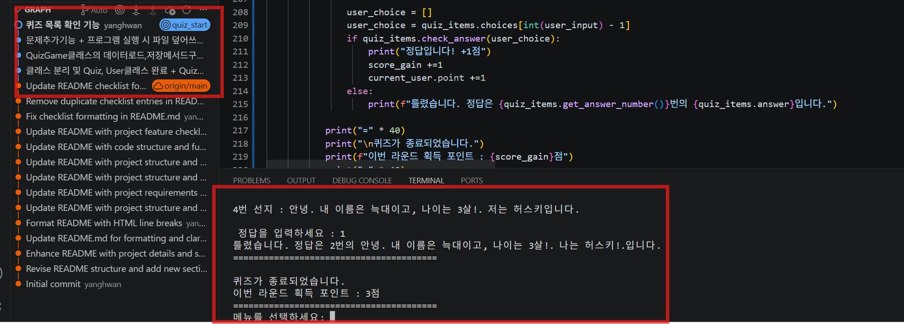
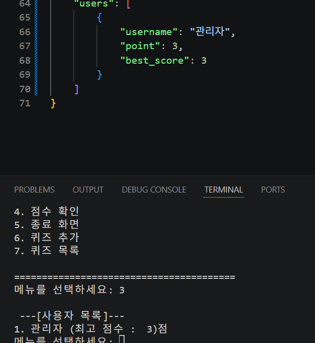
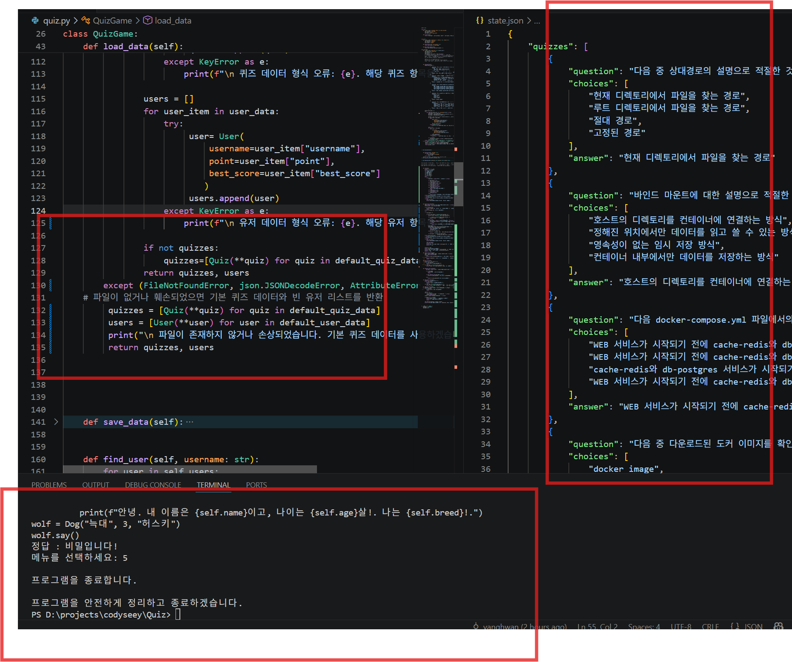
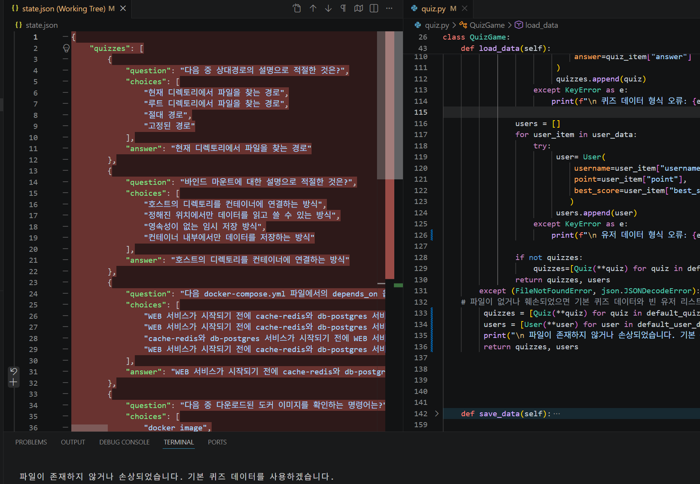
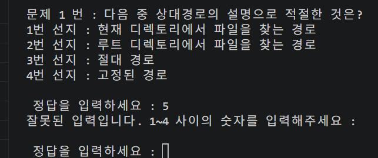

## 기능 요구 사항

- [x] Git 저장소 설정<br>
- [x] 메뉴 기능<br>
- [x] 공통 입력/예외 처리 기준 (최소 요구)<br>
- [x] Quiz 클래스<br>
- [x] 기본 퀴즈 데이터<br>
- [x] 퀴즈 풀기 (브랜치 활용)<br>
- [x] 퀴즈 추가<br>
- [x] 퀴즈 목록<br>
- [x] 점수 확인<br>
- [x] QuizGame 클래스<br>
- [x] 파일 저장/불러오기 (**state.json**)<br>
- [ ] README.md 작성<br>
- [ ] Git 저장소 복제 실습<br>

## 파이썬 CLI 퀴즈 게임 (Python Quiz Game)

이 프로젝트는 파이썬(Python)으로 제작된 터미널(CLI) 기반의 객관식 퀴즈 프로그램입니다.  
사용자 관리, 퀴즈 관리, 점수 누적 및  최고 점수 추적 기능을 제공하며, 모든 데이터는 JSON 파일로 자동 영속화됩니다.
---

## 프로젝트 개요

* **개발 언어**: Python 3.12.2
* **데이터 저장 방식**: JSON (`state.json`)
* **주요 특징**:
  * 터미널 기반의 직관적인 메뉴 CLI 인터페이스
  * 사용자별 누적 포인트 및 개인 최고 점수 기록
  * 사용자 점수 실시간 갱신
  * 예외 처리(Ctrl+C, 파일 손상 등) 및 안전한 데이터 자동 저장 (`finally` 구문 활용)

---

## 퀴즈 주제 및 선정 이유

* **주요 주제**: **개발자 기초 지식 (도커, 파이썬 OOP, 파일 시스템)**
* **선정 이유**:
  * **개발 환경 실무 역량 검증**: 상대경로/절대경로의 개념, Docker Images 명령 및 `docker-compose`의 `depends_on` 동작 원리 등 실제 개발 환경 구축 시 필수적인 핵심 지식을 다룹니다.
  * **객체지향 프로그래밍(OOP) 이해도 점검**: 파이썬 상속 및 메서드 오버라이딩 실행 결과를 직접 추론해 봄으로써 프로그래밍 기초 체력을 점검할 수 있도록 구성했습니다.
  * **기본 지식 점검** : 첫 번째 과제에서 다루었던 내용들과 두 번째 과제를 수행하기 위한 기본적인 지식을 점검하고자 했습니다.

---


## 실행 화면

#### 1. 퀴즈 풀기 진행
등록된 사용자를 선택하여 4지선다 객관식 퀴즈를 풀고 정답 여부를 확인하는 화면입니다.


#### 2. 사용자 등록
프로그램을 실행한 사용자가 등록되었는지 안되어 있는지 확인하고 안되었으면 등록하는 화면입니다.


#### 3. 사용자 목록
등록된 사용자들의 이름과 최고 점수를 알려주는 화면입니다.


#### 4. 점수 확인
점수를 확인하고픈 사용자의 점수를 확인하는 것 입니다.


#### 5. 종료 화면
메인 메뉴에서 '5'를 입력시 프로그램이 종료되는 화면입니다.


#### 6. 퀴즈 추가
등록된 사용자가 퀴즈를 추가하는 화면입니다.


#### 7. 퀴즈 목록
현재 저장된 퀴즈 목록을 확인하는 화면입니다.


#### 8. 예외처리 기준
"비정상 종료" 방지와 파일이 없거나 손상되었을 경우 기본 퀴즈 데이터로 복구하는 화면입니다.

**빈 state.json파일**


**기본 퀴즈 데이터로 복구 된 state.json파일**


**위의 과정의 증거**



#### 9. 공통 입력

**메뉴 선택 시 최소 케이스 처리**


**정답 선택 시 최소 케이스 처리**



## 실행 방법

### 1. 사전 요구사항
* Python 3.10 이상이 설치되어 있어야 합니다.

### 2. 프로그램 실행
별도의 외부 라이브러리 설치 없이 파이썬 표준 라이브러리만으로 실행할 수 있습니다.

```bash
python main.py
```

## 주요 기능 목록
| 번호 | 기능명 | 설명 |
| :---: | :--- | :--- |
| **1** | **퀴즈 풀기** | 등록된 사용자를 선택하여 객관식(4지선다) 퀴즈를 진행합니다. 정답 시 포인트가 획득되며 라운드 최고 점수가 갱신됩니다. |
| **2** | **사용자 등록** | 새로운 사용자를 시스템에 등록합니다. (중복 이름 등록 불가) |
| **3** | **사용자 목록** | 현재 등록된 모든 사용자의 이름, 누적 포인트, 개인 최고 점수를 조회합니다. |
| **4** | **점수 확인** | 특정 사용자의 현재 포인트, 개인 최고 점수를 확인합니다. |
| **5** | **종료 화면** | 안전하게 데이터를 저장하고 프로그램을 종료합니다. |
| **6** | **퀴즈 추가** | 새로운 퀴즈 문제, 4개의 선지, 정답을 직접 입력하여 시스템에 추가합니다. |
| **7** | **퀴즈 목록** | 현재 등록된 모든 퀴즈의 문제 항목을 출력합니다. |


## 파일 구조

```Plaintext
.
├── main.py              # 퀴즈 게임 전체 메인 로직 및 CLI 실행 코드
├── state.json           # 퀴즈 및 사용자 데이터가 저장되는 JSON 파일 (자동 생성)
├── README.md            # 프로젝트 설명 문서
└── images/
    └── play/            # 실행 화면 및 예외 처리 스크린샷 폴더
        ├── quiz_play.png
        ├── user_register.png
        ├── user_list.png
        ├── check_point.png.png
        ├── exit.png
        ├── add_quiz.png
        ├── quiz_list.png
        ├── except1.png
        ├── except2.png
        ├── default_data.png
        ├── menu_except.png
        └── choice_except.png
```

## 데이터 파일 설명 (state.json)
### 1. 경로 및 역할

**경로**: 프로젝트 QUIZ 디렉토리 내 /state.json

**역할**: 프로그램이 실행될 때 데이터를 로드하고, 새로운 퀴즈/사용자 등록 또는 게임 종료 시 현재 변경 상태를 자동으로 반영·저장합니다. <br>
파일이 없거나 손상되었을 경우 기본 퀴즈 데이터로 자동 복원 및 초기화됩니다.<br>


### 2. 데이터 스키마 (JSON Schema)

```json
{
  "quizzes": [
    {
      "question": "문제 내용 (문자열)",
      "choices": [
        "1번 선지",
        "2번 선지",
        "3번 선지",
        "4번 선지"
      ],
      "answer": "정답 텍스트 (choices 배열에 존재하는 값과 일치해야 함)"
    }
  ],
  "users": [
    {
      "username": "사용자 이름 (문자열)",
      "point": 0,          // 누적 획득 포인트 (정수)
      "best_score": 0     // 한 라운드에서의 개인 최고 점수 (정수)
    }
  ]
}
```


